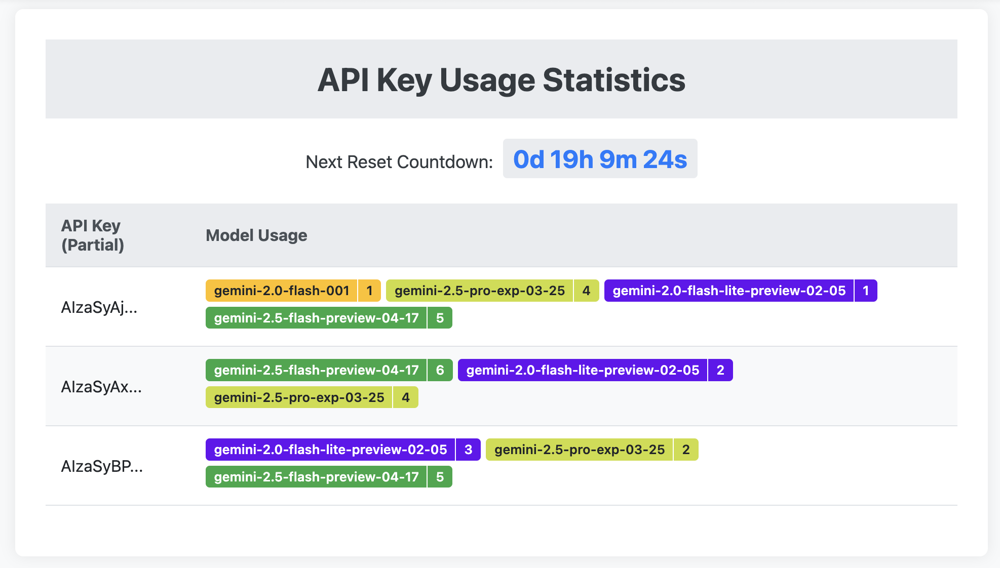

# Gemini Proxy

## 简介

本项目是一个 Cloudflare Workers 应用，用于代理 Google Gemini API 请求，并智能地切换多个 API key。
支持且自动识别 Gemini 和 OpenAI 风格的 API 请求。


## 部署步骤

1.  **配置 Cloudflare 账号：**

    ```bash
    npx wrangler login
    ```

2.  **配置环境变量：**

    你需要配置以下环境变量：

    *   `GEMINI_UPSTREAM_URL`：上游 GEMINI 风格 API 的 URL，如 `https://generativelanguage.googleapis.com/v1beta`。这通常在 `wrangler.jsonc` 中设置。
    *   `OPENAI_UPSTREAM_URL`: 上游 OPENAI 风格 API 的 URL，如 `https://generativelanguage.googleapis.com/v1beta/openai`。这通常在 `wrangler.jsonc` 中设置。
    *   `API_KEYS`：API key 列表，多个 key 之间用逗号分隔。应使用 `wrangler secret put API_KEYS` 进行设置。
    *   `PROXY_API_KEY`：（可选）用于请求验证的自定义 API key。应使用 `wrangler secret put PROXY_API_KEY` 进行设置。

    如果设置了 `PROXY_API_KEY`，传入的 API 代理请求必须包含此 key 进行身份验证。客户端可以通过以下两种方式之一提供 key：
        *   **对于 OpenAI 风格请求：** 在请求头部包含 `Authorization: Bearer <key>`。
        *   **对于 Gemini 风格请求：** 在 URL 中包含 `key=<key>` 查询参数。

    你可以使用以下命令配置环境变量：

    ```bash
    npx wrangler secret put API_KEYS
    npx wrangler secret put PROXY_API_KEY
    ```

    你可以在 `wrangler.jsonc` 文件中配置 `GEMINI_UPSTREAM_URL` 和 `OPENAI_UPSTREAM_URL`：

    ```json
    "vars": {
        "GEMINI_UPSTREAM_URL": "https://generativelanguage.googleapis.com/v1beta",
        "OPENAI_UPSTREAM_URL": "https://generativelanguage.googleapis.com/v1beta/openai",
    },
    ```

    **注意：**  使用 `wrangler secret put` 命令配置的环境变量会加密存储，更加安全。

3.  **部署 Worker：**

    ```bash
    npx wrangler deploy
    ```

## `wrangler` 命令使用

*   `npx wrangler login`：配置 Cloudflare 账号。
*   `npx wrangler secret put <key>`：配置加密环境变量。
*   `npx wrangler deploy`：部署 Worker。
*   `npx wrangler dev`：在本地开发和测试 Worker。

## 异常处理

本项目尽可能地捕获异常，并在 HTTP 返回的内容里打印具体异常和 stacktrace 等信息，方便调试。

## API Key 管理

本项目使用 Durable Objects 来管理 API Key。

*   `API_KEY_MANAGER`：Durable Object 的绑定名称，在 `wrangler.toml` 文件中配置。

## 定时任务

本项目每天在 GMT+8 15:00 (UTC 07:00) 通过定时任务重置所有 key 的状态。

## 模型使用统计页面 (`/stat`)

本项目包含一个 `/stat` 页面，用于显示 API Key 和模型的使用统计信息。可通过访问 `/stat` 路径来访问此页面。

**特性：**

*   **模型用量展示**：显示每个 API Key 下各模型的调用次数。
*   **超额标记**：因上游返回 429 错误而对特定模型耗尽的 API Key 会在页面上被标记。
*   **超额原因展示**：点击被标记为超额的模型，可在页面下方展示上游 API 返回的具体耗尽原因。

